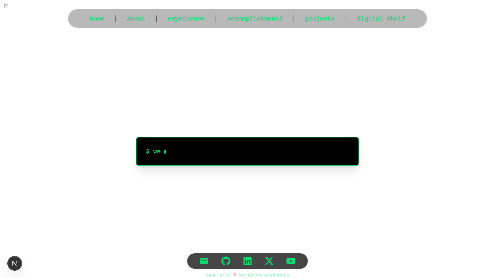
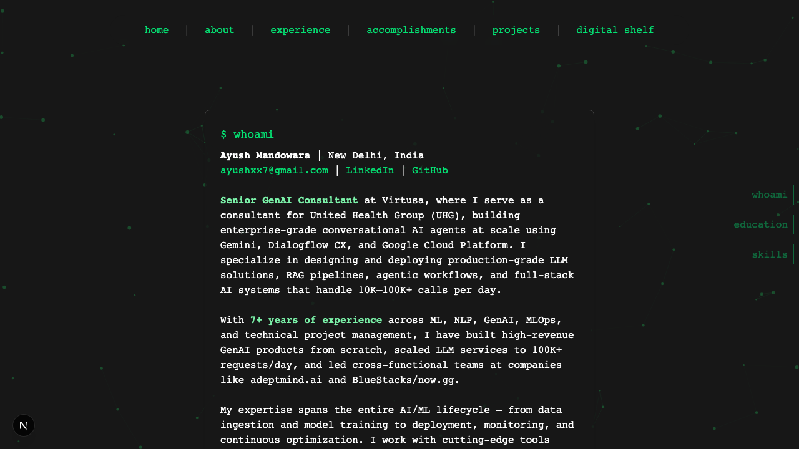
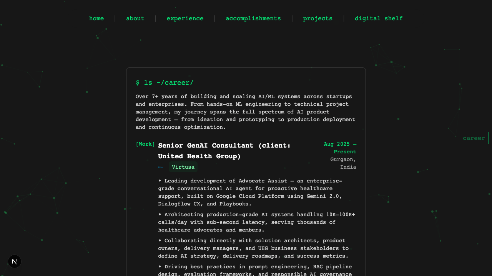

# Ayush Mandowara Portfolio

A terminal-themed portfolio website built with Next.js. Features an interactive terminal emulator with command navigation.

## Tech Stack

- **Next.js 16** - App framework
- **React 19** - UI library
- **Tailwind CSS 4** - Styling
- **Framer Motion** - Animations
- **Playwright** - E2E testing

## Getting Started

```bash
npm install
npm run dev
```

## Terminal Commands

- `help` - Show available commands
- `about` - Navigate to about page
- `experience` - Navigate to experience page
- `projects` - Navigate to projects page
- `accomplishments` - Navigate to accomplishments page
- `shelf` - Navigate to shelf page
- `skills` / `core skills` / `stack` - View core skills
- `cat skills.json` - Navigate to /about#skills
- `cd <dir>` - Change directory navigation

## Commands

```bash
npm run dev        # Start dev server
npm run build      # Production build
npm run lint       # Lint check
npm run test:e2e  # Run E2E tests
```

## Screenshots

### Terminal (Home)


### About Page


### Experience Page


---

## Deploy

Deployed on Vercel - push to main and it auto-deploys.