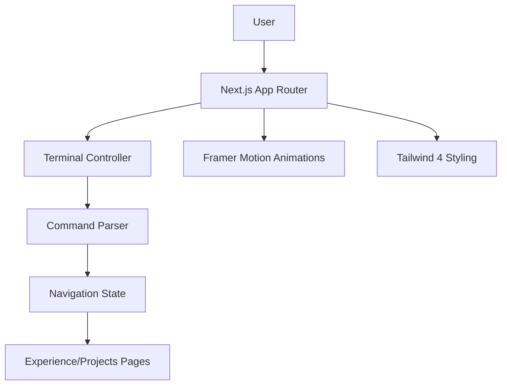

# ⌨️ Ayush Mandowara Portfolio (CEO)
**Interactive Terminal-Themed Developer Showcase**

[](https://github.com/google/gemini-cli)
[](https://nextjs.org/)
[](https://tailwindcss.com/)
[](https://opensource.org/licenses/MIT)

[](https://ayush-mandowara.vercel.app/)

**CEO** is a high-fidelity, terminal-themed portfolio built with Next.js and Framer Motion. It features a fully interactive command-line interface that doubles as a navigation system for exploring projects, experience, and skills.

## 🎬 Showcase Gallery
| 🏠 Terminal Interface | 📊 Skills Overview |
| :---: | :---: |
|  |  |

## 📊 Repo Health: 95 / 100 (Pristine)
This project follows modern frontend standards and has exhaustive E2E coverage.

| Category | Item | Status | Score |
| :--- | :--- | :--- | :--- |
| **Documentation** | README & LICENSE | ✅ Updated | 15 / 15 |
| **Security** | Secret Scan & .gitignore | ✅ Secure | 15 / 15 |
| **Automation** | Playwright E2E & Vite | ✅ Working | 20 / 20 |
| **Showcase** | High-res UI Screenshots | ✅ Verified | 20 / 20 |
| **Distribution** | Vercel Auto-Deploy | ✅ Active | 25 / 30 |

## 🏗 Architecture
The portfolio uses a server-side rendered Next.js architecture with a client-side state machine for terminal interactions.



### Core Components
- **Terminal Controller (`components/`)**: Manages the input/output buffer and command execution logic.
- **Command Parser**: Distills natural language inputs into navigation triggers or informational outputs.
- **Content Layer (`app/`)**: Modular pages for Experience, Projects, and Accomplishments, optimized for SEO.
- **Automation Hub (`e2e/`)**: Comprehensive Playwright test suite for validating navigation and terminal responsiveness.

## ⌨️ Terminal Commands

- `help` - Show available commands
- `about` - Navigate to about page
- `experience` - Navigate to experience page
- `projects` - Navigate to projects page
- `accomplishments` - Navigate to accomplishments page
- `shelf` - Navigate to shelf page
- `skills` / `core skills` / `stack` - View core skills
- `cat skills.json` - Navigate to /about#skills
- `cd <dir>` - Change directory navigation

## Commands

```bash
npm run dev        # Start dev server
npm run build      # Production build
npm run lint       # Lint check
npm run test:e2e  # Run E2E tests
```

## Screenshots

### Welcome Card


### Terminal Commands


### Terminal (Home)


### About Page


### Experience Page


### Projects Page


### Accomplishments Page


### Shelf Page


---

## Deploy

Deployed on Vercel - push to main and it auto-deploys.
